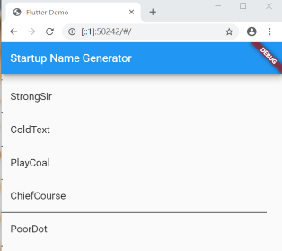
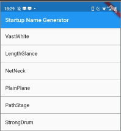
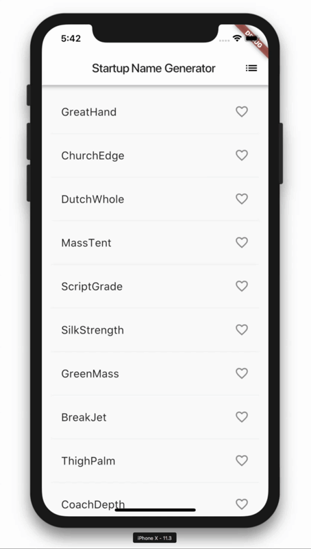

# 编写第一个 Flutter 应用

## 构建 Web 应用

使用最新的 beta 频道的 Flutter SDK，并开启 web 支持：终端依次输入如下命令

```
 flutter channel beta
 flutter upgrade
 flutter config --enable-web
```

对一个已有的工程添加 Web 支持，需要在工程根目录下输入下面的命令：

```
flutter create .
```

运行 Web 程序

```
flutter run -d chrome
```


> windows 系统 flutter 配置文件路径：
> C:\Users\\${当前登录用户名}\AppData\Roaming\\.flutter_settings

## Getting Started

### 外部 package

pubspec.yaml 文件管理 Flutter 应用程序的
assets（资源，如图片、package等）。在文件 dependencies 节点下添加 package
(注意缩进,yaml语法)

```
dependencies:
  flutter:
    sdk: flutter
  cupertino_icons: ^0.1.2
  //新增 
  english_words: ^3.1.5 // ^3.1.5 表示版本 ≥ 3.1.5  
```
点击编辑器右上角 `` Packages get `` ，或者在终端执行 `` flutter pub get `` 命令下载 package

成功获取 package 后会更新 pubspec.lock 文件，文件中更新了新增 package 的具体信息

```
  english_words:
    dependency: "direct main"
    description:
      name: english_words
      url: "https://pub.flutter-io.cn"
    source: hosted
    version: "3.1.5"
```
 > `` Packages get `` 命令执行后会更新  pubspec.lock 文件，如果 pubspec.lock 文件不存在会重新生成

使用 package ：在需要使用 package 的 dart 文件中用 import 关键字引入即可。

```
import 'package:flutter/material.dart';
import 'package:english_words/english_words.dart';
```
## 热身 简单的 ListView

先看一遍，看明白照着码，看不明白也照着码，呃,,,,长大了就会懂了。

Divider 在 chrome 上有Bug



在 Android 真机上木有问题 , 怪不得跑 WEB 项目要切 Beta 分支...



>  i ~/ 2 表示 i 除以 2，但返回值是整形（向下取整），比如 i 为：1, 2, 3, 4, 5 时，结果为 0, 1, 1, 2 值是整形（向下取整），比如 i 为：1, 2, 3, 4, 5 时，结果为 0, 1, 1, 2, 2, 2

## 真正的第一个项目

项目中涉及了 StatefulWidget、ListView、路由、主题等概念。不管懂不懂照着码一遍，然后带着问题入门。

完成一个简单的移动应用程序，功能是：为一个创业公司生成建议的名称。用户可以选择和取消选择的名称、保存（收藏）喜欢的名称。该代码一次生成十个名称，当用户滚动时，会生成一新批名称。用户可以点击导航栏右边的列表图标，以打开到仅列出收藏名称的新页面（route）。



> https://codelabs.flutter-io.cn/codelabs/first-flutter-app-pt2-cn/index.html


- 调用 setState() 会为 State 对象触发 build() 方法，从而导致对 UI 的更新

