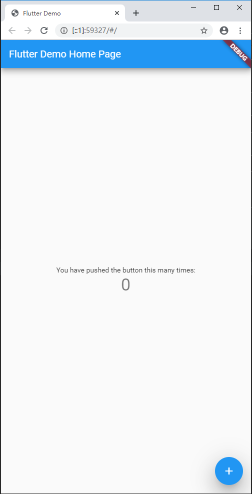

# 编写第一个 Flutter 应用

## 构建 Web 应用

使用最新的 beta 频道的 Flutter SDK，并开启 web 支持：终端依次输入如下命令

```
 flutter channel beta
 flutter upgrade
 flutter config --enable-web
```

对一个已有的工程添加 Web 支持，需要在工程根目录下输入下面的命令：

```
flutter create .
```

运行 Web 程序

```
flutter run -d chrome
```




> windows 系统 flutter 配置文件路径：
> C:\Users\\${当前登录用户名}\AppData\Roaming\\.flutter_settings

## Getting Started

### 外部 package

pubspec.yaml 文件管理 Flutter 应用程序的
assets（资源，如图片、package等）。在文件 dependencies 节点下添加 package
(注意缩进,yaml语法)

```
dependencies:
  flutter:
    sdk: flutter
  cupertino_icons: ^0.1.2
  //新增 
  english_words: ^3.1.5 // ^3.1.5 表示版本 ≥ 3.1.5  
```
点击编辑器右上角 `` Packages get `` ，或者在终端执行 `` flutter pub get `` 命令下载 package

成功获取 package 后会更新 pubspec.lock 文件，文件中更新了新增 package 的具体信息

```
  english_words:
    dependency: "direct main"
    description:
      name: english_words
      url: "https://pub.flutter-io.cn"
    source: hosted
    version: "3.1.5"
```
 > `` Packages get `` 命令执行后会更新  pubspec.lock 文件，如果 pubspec.lock 文件不存在会重新生成

使用 package ：在需要使用 package 的 dart 文件中用 import 关键字引入即可。

```
import 'package:flutter/material.dart';
import 'package:english_words/english_words.dart';
```